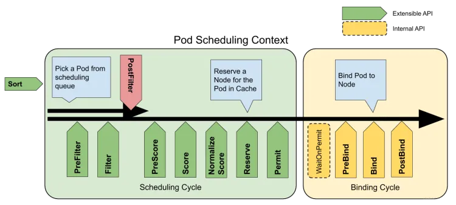

# 部署流程

## 1、部署gpu-admission pod
```bash
kubectl apply -f deploy/gpu-admission.yaml
```

## 2、修改kube-scheduler.yaml
- command处增加

```yaml
- command:
  - --config=/etc/kubernetes/scheduler-extender.yaml
```

- volumeMounts处增加

```yaml
volumeMounts:
- mountPath: /etc/localtime
      name: localtime
      readOnly: true
- mountPath: /etc/kubernetes/scheduler-extender.yaml
      name: extender
      readOnly: true
- mountPath: /etc/kubernetes/scheduler-policy-config.json
      name: extender-policy
      readOnly: true
```

- volumes处增加

```yaml
volumes:
- hostPath:
      path: /etc/localtime
      type: File
    name: localtime
- hostPath:
      path: /etc/kubernetes/scheduler-extender.yaml
      type: FileOrCreate
    name: extender
- hostPath:
      path: /etc/kubernetes/scheduler-policy-config.json
      type: FileOrCreate
    name: extender-policy
```

# 调度器1.23之前的配置文件Policy参数详解

## predicates 预选阶段
PodFitsHostPorts 节点上已经使用的 port 是否和 Pod 申请的 port 冲突
PodFitsHost 如果 Pod 指定了 NodeName 检查节点名称是否和 NodeName 匹配
PodSelectorMatches 过滤掉和 Pod 指定的 label 不匹配的节点
MatchNodeSelector 
PodFitsResources 计算的就是宿主机的 CPU 和内存资源等是否够用。
NoDiskConflict 检查的条件，是多个 Pod 声明挂载的持久化 Volume 是否有冲突。
CheckNodeDiskPressure：检查节点磁盘空间是否符合要求
CheckNodeMemoryPressure：检查节点内存是否够用


PodFitsHostPorts：检查 Pod 请求的端口（网络协议类型）在节点上是否可用。
PodFitsHost：检查 Pod 是否通过主机名指定了 Node。
PodFitsResources：检查节点的空闲资源（例如，CPU和内存）是否满足 Pod 的要求。
MatchNodeSelector：检查 Pod 的节点选择算符 和节点的 标签 是否匹配。Volume Filtering Rules 主要包含以下关键策略：
NoVolumeZoneConflict：给定该存储的故障区域限制， 评估 Pod 请求的卷在节点上是否可用。
NoDiskConflict：根据 Pod 请求的卷是否在节点上已经挂载，评估 Pod 和节点是否匹配。
MaxCSIVolumeCount：决定附加 CSI 卷的数量，判断是否超过配置的限制。
CheckVolumeBinding：基于 Pod 的卷请求，评估 Pod 是否适合节点，这里的卷包括绑定的和未绑定的 PVCs 都适用。Host Filtering Rules 主要包含以下关键策略：
PodToleratesNodeTaints：检查 Pod 的容忍 是否能容忍节点的污点。
NodeMemoryPressurePredicate：检查待考察节点的内存是不是已经不够充足
CheckNodeConditionPred：检查 NodeCondition * CheckNodePIDPressurePred: 检查 NodePIDPressure * CheckNodeDiskPressurePred: 检查 NodeDiskPressure
CheckNodeMemoryPressurePred: 检查 NodeMemoryPressure Pod Filtering Rules 主要包含以下关键策略：
GeneralPredicates：GeneralPredicates 的4个策略
PodAffinityPredicate：检查待调度 Pod 与 Node 上的已有 Pod 之间的亲密（affinity）和反亲密（anti-affinity）关系（ pod 中配置的 spec.affinity.podAntiAffinity.requiredDuringSchedulingIgnoredDuringExecution 属性)

## priorities 优选阶段
LeastRequestedPriority：通过计算 CPU 和内存的使用率来决定权重，使用率越低权重越高，当然正常肯定也是资源是使用率越低权重越高，能给别的 Pod 运行的可能性就越大
SelectorSpreadPriority：为了更好的高可用，对同属于一个 Deployment 或者 RC 下面的多个 Pod 副本，尽量调度到多个不同的节点上，当一个 Pod 被调度的时候，会先去查找该 Pod 对应的 controller，然后查看该 controller 下面的已存在的 Pod，运行 Pod 越少的节点权重越高
ImageLocalityPriority：就是如果在某个节点上已经有要使用的镜像节点了，镜像总大小值越大，权重就越高
NodeAffinityPriority：这个就是根据节点的亲和性来计算一个权重值，后面我们会详细讲解亲和性的使用方法
BalancedResourceAllocation 计算的是 CPU 和 Memory 与 Allocable 资源量的分数，并且求出他们的方差 Variance，最终会将 Pod 调度到前述方差更小的节点 Node 上。

SelectorSpreadPriority：属于同一 Service、 StatefulSet 或 ReplicaSet 的 Pod，跨主机部署。
InterPodAffinityPriority：实现了 Pod 间亲和性与反亲和性的优先级。
LeastRequestedPriority：偏向最少请求资源的节点。换句话说，节点上的 Pod 越多，使用的资源就越多，此策略给出的排名就越低。
MostRequestedPriority：支持最多请求资源的节点。该策略将 Pod 调度到整体工作负载所需的最少的一组节点上。
RequestedToCapacityRatioPriority：使用默认的打分方法模型，创建基于 ResourceAllocationPriority 的 requestedToCapacity。
BalancedResourceAllocation：偏向平衡资源使用的节点。
NodePreferAvoidPodsPriority：根据节点的注解 http://scheduler.alpha.kubernetes.io/preferAvoidPods 对节点进行优先级排序。你可以使用它来暗示两个不同的 Pod 不应在同一节点上运行。
NodeAffinityPriority：根据节点亲和中 PreferredDuringSchedulingIgnoredDuringExecution 字段对节点进行优先级排序。你可以在将 Pod 分配给节点中了解更多。
TaintTolerationPriority：根据节点上无法忍受的污点数量，给所有节点进行优先级排序。此策略会根据排序结果调整节点的等级。
ImageLocalityPriority：偏向已在本地缓存 Pod 所需容器镜像的节点。
ServiceSpreadingPriority：对于给定的 Service，此策略旨在确保该 Service 关联的 Pod 在不同的节点上运行。它偏向把 Pod 调度到没有该服务的节点。整体来看，Service 对于单个节点故障变得更具弹性。
EqualPriority：给予所有节点相等的权重。
EvenPodsSpreadPriority：实现了 Pod 拓扑扩展约束的优先级排序。

# 调度器1.23之后的配置文件KubeSchedulerConfiguration参数详解
## yaml配置分析
```yaml
apiVersion: kubescheduler.config.k8s.io/v1
kind: KubeSchedulerConfiguration
clientConnection:
  kubeconfig: "/etc/kubernetes/scheduler.conf" # 配置调度器访问api-server客户端的kubeconfig文件位置
  acceptContentTypes: "application/json" #定义客户端在连接到服务器时发送的Accept标头，覆盖默认值“application/json”。此字段将控制特定客户端使用的与服务器的所有连接。
  contentType: "application/json" # 从该客户端向服务器发送数据时使用的内容类型。
  qps: 50   #qps控制该连接每秒允许的查询数。
  burst: 10 #允许在客户端超过其速率时累积额外的查询。
parallelism: 16 #定义用于调度Pods的算法中的并行度。必须大于0。默认为16
percentageOfNodesToScore: 50 # PercentageOfNodesToScore是所有节点的百分比，一旦发现运行pod可行，调度器就会停止在集群中搜索更多可行的节点。这有助于提高调度程序的性能。无论这个标志的值是多少，调度器总是试图找到至少“minFeasibleNodesToFind”个可行节点。例如：如果集群大小是500个节点，而这个标志的数值是30，那么调度器一旦找到150个可行节点，就停止寻找更多的可行节点。当该值为0时，将对节点的默认百分比（5%-50%，基于集群的大小）进行评分。它被配置文件级别PercentageofNodesToScore覆盖。
podInitialBackoffSeconds: 1 # 不可调度的Pod的初始回退。必须大于0, 默认值（1s）。
podMaxBackoffSeconds: 10  # 不可调度pod的最大回退。如果指定，它必须大于podInitialBackoffSeconds。如果为空默认值（10s）。
leaderElection: # leader选举功能配置
  leaderElect: false # 使领导者选举客户端能够在执行主循环之前获得领导力，需要给调度器sa lease权限，在多副本模式为调度器提高可用性时，需要开启此配置
  LeaseDuration:  10s # leaseDuration是非领导人候选人在观察到领导层更新后等待的时间，直到试图获得领导但未更新的领导人职位的领导权。这实际上是领导者在被另一位候选人取代之前可以被阻止的最长时间。这仅适用于启用领导人选举的情况。
  renewDeadline: 10s # renewDeadline是领导者在停止领导之前尝试更新领导位置的间隔时间。这必须小于或等于租赁期限。这仅适用于启用领导人选举的情况。
  retryPeriod: 5s # retryPeriod是客户在尝试收购和更新领导层之间应该等待的时间。这仅适用于启用领导人选举的情况。
  resourceLock: # resourceLock表示在领导人选举周期期间将用于锁定的资源对象类型。
  resourceName: # resourceName表示在领导人选举周期中将用于锁定的资源对象的名称。
  resourceNamespace: # 表示在领导人选举周期期间将用于锁定的资源对象的命名空间。
profiles:
  - schedulerName: multipoint-scheduler # 配置调度器名称，为空则使用default-scheduler
    plugins:
      multiPoint:
        enabled:
        - name: MyPlugin1 # 自动打开该插件的所有拓展点 （只要插件实现了对应阶段的拓展）
      preScore:
        enabled:
        - name: MyPlugin # 开启preScore阶段的MyPlugin插件
      score:
        enabled:
        - name: MyPlugin # 开启score阶段的MyPlugin插件
          weight: 3     # 可以配置该插件在当前阶段的权重
      preFilter:
        enabled:
        - name: MyPlugin
        disabled:
        - name: '*'   # 可以选择在某些阶段关闭某些插件
      filter:
        enabled:
        - name: MyPlugin
extenders:
  - urlPrefix: "http://gpu-admission.kube-system:3456/scheduler" # url 请求前缀
    filterVerb: # filter阶段的请求接口谓词，可以用于过滤可调度节点
    preemptVerb:  # 抢占调用的谓词，如果不支持，则为空。当向扩展器发出抢占调用时，此谓词会附加到URLPrefix。
    prioritizeVerb: # 优先级调用的谓词，可以用于给pod的调度优先级排序。当向扩展器发出优先级调用时，此谓词会附加到URLPrefix。
    bindVerb: # 绑定节点阶段的请求接口谓词
    weight: # 调用的优先级权重
    enableHTTPS: false # 是否打开https
    nodeCacheCapable: false # 外部调度器是否有node缓存
    httpTimeout: 30s # 接口超时时间
    tlsConfig: # https相关证书配置
      insecure: true # 跳过证书验证
      serverName:  # ServerName被传递给SNI的服务器，并在客户端中用于检查服务器证书。如果ServerName为空，则使用用于联系服务器的主机名。
      certFile:
      keyFile:
      caFile:
      certData: 
      keyData:
      caData:
    managedResources:  # 此扩展程序管理的扩展资源的列表 
    # -如果pod请求该列表中的至少一个扩展资源，则将在Filter、Prioritize、Bind（如果扩展器是绑定器）阶段向扩展器发送pod。如果为空或未指定，则所有pod都将发送到此扩展器。
    # -如果IgnoredByScheduler设置为true，调度器将跳过在谓词中检查资源。
    - name: "nvidia.com/vcuda-core"
    - name: "nvidia.com/vcuda-memory"
      ignoredByScheduler: true 
    ignorable: true # Ignorable指定扩展程序是否可忽略，即当扩展程序返回错误或无法访问时，调度不应失败。
```

## extenders 外部拓展点
preemptVerb 插件可以实现以下功能：

1、优先级抢占：当一个 pod 需要抢占另一个 pod 的资源时，它会首先修改目标 pod 的优先级，将其设置为较低的优先级。然后，它会尝试将自身设置为较高的优先级，以获得更多的资源。
2、抢占阈值：preemptVerb 插件可以设置抢占阈值，即当一个 pod 的资源使用率达到一定比例时，允许其抢占其他 pod 的资源。默认情况下，抢占阈值为 50%。
3、抢占策略：preemptVerb 插件可以设置抢占策略，例如 FIFO（先到先得）或 LIFO（最后到先得）。默认情况下，使用 FIFO 策略。

prioritizeVerb: # 优先级调用的谓词，可以用于给pod的调度优先级排序。在preFilter之后、Filter之前执行

bindVerb: 

## 不同插件拓展点执行顺序


## 阶段性插件详情
默认启用的调度插件及扩展点
下面默认启用的插件实现了一个或多个扩展点：

ImageLocality：选择已经存在 Pod 运行所需容器镜像的节点。
实现的扩展点：score。

TaintToleration：实现了污点和容忍。
实现的扩展点：filter、preScore、score。

NodeName：检查 Pod 指定的节点名称与当前节点是否匹配。
实现的扩展点：filter。

NodePorts：检查 Pod 请求的端口在节点上是否可用。
实现的扩展点：preFilter、filter。

NodeAffinity：实现了节点选择器 和节点亲和性。
实现的扩展点：filter、score。

PodTopologySpread：实现了 Pod 拓扑分布。
实现的扩展点：preFilter、filter、preScore、score。

NodeUnschedulable：过滤 .spec.unschedulable 值为 true 的节点。
实现的扩展点：filter。

NodeResourcesFit：检查节点是否拥有 Pod 请求的所有资源。 得分可以使用以下三种策略之一：LeastAllocated（默认）、MostAllocated 和 RequestedToCapacityRatio。
实现的扩展点：preFilter、filter、score。

NodeResourcesBalancedAllocation：调度 Pod 时，选择资源使用更为均衡的节点。
实现的扩展点：score。

VolumeBinding：检查节点是否有请求的卷，或是否可以绑定请求的卷。 实现的扩展点：preFilter、filter、reserve、preBind 和 score。
说明：
当 VolumeCapacityPriority 特性被启用时，score 扩展点也被启用。 它优先考虑可以满足所需卷大小的最小 PV。
VolumeRestrictions：检查挂载到节点上的卷是否满足卷提供程序的限制。
实现的扩展点：filter。

VolumeZone：检查请求的卷是否在任何区域都满足。
实现的扩展点：filter。

NodeVolumeLimits：检查该节点是否满足 CSI 卷限制。
实现的扩展点：filter。

EBSLimits：检查节点是否满足 AWS EBS 卷限制。
实现的扩展点：filter。

GCEPDLimits：检查该节点是否满足 GCP-PD 卷限制。
实现的扩展点：filter。

AzureDiskLimits：检查该节点是否满足 Azure 卷限制。
实现的扩展点：filter。

InterPodAffinity：实现 Pod 间亲和性与反亲和性。
实现的扩展点：preFilter、filter、preScore、score。

PrioritySort：提供默认的基于优先级的排序。
实现的扩展点：queueSort。

DefaultBinder：提供默认的绑定机制。
实现的扩展点：bind。

DefaultPreemption：提供默认的抢占机制。
实现的扩展点：postFilter。

你也可以通过组件配置 API 启用以下插件（默认不启用）：
CinderLimits：检查是否可以满足节点的 OpenStack Cinder 卷限制。 实现的扩展点：filter。


## 调度器默认配置
```go
func getDefaultPlugins() *v1.Plugins {
	plugins := &v1.Plugins{
		MultiPoint: v1.PluginSet{
			Enabled: []v1.Plugin{
				{Name: names.PrioritySort},
				{Name: names.NodeUnschedulable},
				{Name: names.NodeName},
				{Name: names.TaintToleration, Weight: ptr.To[int32](3)},
				{Name: names.NodeAffinity, Weight: ptr.To[int32](2)},
				{Name: names.NodePorts},
				{Name: names.NodeResourcesFit, Weight: ptr.To[int32](1)},
				{Name: names.VolumeRestrictions},
				{Name: names.EBSLimits},
				{Name: names.GCEPDLimits},
				{Name: names.NodeVolumeLimits},
				{Name: names.AzureDiskLimits},
				{Name: names.VolumeBinding},
				{Name: names.VolumeZone},
				{Name: names.PodTopologySpread, Weight: ptr.To[int32](2)},
				{Name: names.InterPodAffinity, Weight: ptr.To[int32](2)},
				{Name: names.DefaultPreemption},
				{Name: names.NodeResourcesBalancedAllocation, Weight: ptr.To[int32](1)},
				{Name: names.ImageLocality, Weight: ptr.To[int32](1)},
				{Name: names.DefaultBinder},
			},
		},
	}
	applyFeatureGates(plugins)

	return plugins
}
```

